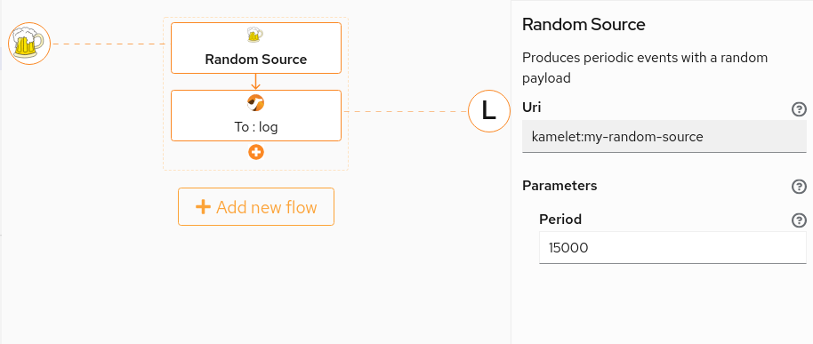

# Kamelets Workshop - Fuse F2F

This workshop will drive you to the basics of writing new Kamelets, using and sharing them with the community.

**Prizes are available** for the 3 people who provide the most complete solutions to the last exercise (see below).

## Introduction

This workshop is divided into multiple parts with increasing level of difficulty.

We'll stay connected for **50 minutes** to provide help during the initial steps, bust last exercise (the one that is valid for the prize) can be completed also in the next few days (**deadline for submission is Monday December 6th at 18:00 CET**).

It's required that you install on your machine some tools that will help you to write and tests the Kamelets. 

## 0. Setting up the environment

### 0.1 Install requirements

You need the following tools:

- [JBang](https://www.jbang.dev/): you need to install it on your machine.
- [VS Code](https://code.visualstudio.com/): install latest version available for your OS.
- [Extension Pack for Apache Camel by Red Hat (includes Didact)](https://marketplace.visualstudio.com/items?itemName=redhat.apache-camel-extension-pack): available from the Extension Marketplace within VS Code.
- [Camel Karavan Designer](https://marketplace.visualstudio.com/items?itemName=camel-karavan.karavan): available from the Extension Marketplace within VS Code.
- [Kamel CLI](https://github.com/apache/camel-k/releases): needed only for scaffolding here, download the binary for your platform and put it in path.

Once you've all requirements met, go to the next step.

## 0.2. Open this readme properly

Check out this project using git in your machine and open it with VS Code.

Right-click on the `README.didact.md` file then click on `Didact: start Didact Tutorial from File`.

I like to think that **Brian would be happy** for anyone doing this.

## 0.3 Check the requirements

Thanks to Didact, we can check if you've installed everything correctly.

[Check if JBang is installed](didact://?commandId=vscode.didact.cliCommandSuccessful&text=jbang-requirements-status$$jbang%20version&completion=Checked%20jbang%20tool%20availability "Tests to see if `jbang version` returns a 0 return code"){.didact}

*Status: unknown*{#jbang-requirements-status}

[Check if the VS Code Extension Pack for Apache Camel by Red Hat is installed](didact://?commandId=vscode.didact.extensionRequirementCheck&text=extension-requirement-status$$redhat.apache-camel-extension-pack&completion=Check%20Camel%20extension%20pack%20is%20available%20on%20this%20system. "Checks the VS Code workspace to make sure the extension pack is installed"){.didact}

*Status: unknown*{#extension-requirement-status}

[Check if the VS Code Karavan Designer is installed](didact://?commandId=vscode.didact.extensionRequirementCheck&text=karavan-requirement-status$$camel-karavan.karavan&completion=Check%20Karavan%20designer%20is%20available%20on%20this%20system. "Checks the VS Code workspace to make sure the Karavan designer is installed"){.didact}

*Status: unknown*{#karavan-requirement-status}

[Check if Kamel is installed](didact://?commandId=vscode.didact.cliCommandSuccessful&text=kamel-requirements-status$$kamel%20version&completion=Checked%20kamel%20tool%20availability "Tests to see if `kamel version` returns a 0 return code"){.didact}

*Status: unknown*{#kamel-requirements-status}


<a href='didact://?commandId=vscode.didact.validateAllRequirements' title='Validate all requirements!'><button>Validate all Requirements at Once!</button></a>


## 1. Use Kamelets with JBang

The Camel JBang extension allows to run Camel integrations that use Kamelets from the [default catalog at Apache](https://camel.apache.org/camel-kamelets/next/). We'll see later how we can also use locally defined Kamelets during development.

### 1.1 Run your first Kamelet using JBang

As starting point, we'll run a Kamelet from the default catalog: the [Chuck Norris Source](https://camel.apache.org/camel-kamelets/next/chuck-norris-source.html).

To use it, we need to define an integration flow. Create an `example.yaml` file with the following content:

```
- from:
    uri: "kamelet:chuck-norris-source"
    parameters:
      period: "15000"
    steps:
      - to: "log:info?showStreams=true"
```

As you see, the route starts from the `kamelet:chuck-norris-source` endpoint and just prints each generated event. We override the default period defined in the Kamelet to set it to 15 seconds.

To run the integration, you can use the following JBang command:

```
jbang --deps=org.apache.camel.kamelets:camel-kamelets:0.5.0 CamelJBang@apache/camel run example.yaml
```
([^ execute](didact://?commandId=vscode.didact.sendNamedTerminalAString&text=newTerminal$$jbang%20--deps=org.apache.camel.kamelets:camel-kamelets:0.5.0%20CamelJBang@apache/camel%20run%20example.yaml))

If everything works correctly, you should see some Chuck Norris sentences in the logs.

[**To exit JBang**, just click here](didact://?commandId=vscode.didact.sendNamedTerminalCtrlC&text=newTerminal&completion=Integration%20interrupted. "Interrupt the current operation on the terminal"){.didact} 
or hit `ctrl+c` on the terminal window.

## 2. Create your own Kamelet

We're now going to create our first Kamelet and test it with JBang.

### 2.1. Pick a nice API

Go to [https://random-data-api.com/documentation](https://random-data-api.com/documentation) and find the API that's best
for you (some people used the "beer" API in the past).

**Copy the URL of the API** that you need to invoke in order to produce random data, then proceed to the next step.
E.g. the URL `https://random-data-api.com/api/beer/random_beer` produces random beers when invoked.

### 2.2. Create an integration that uses the API

We are going to create an integration file that picks data from the API you've chosen and prints it in the logs and
we're going to run it wit JBang.

Create a file named `test.yaml` with the following content:

```
# Beware of YAML spacing when you copy/paste

- from:
    uri: "timer:tick"
    parameters:
      period: "5000"
    steps:
    - to: "https://random-data-api.com/api/beer/random_beer" # Replace this with the one you chose in previous step
    - to: "log:info?showStreams=true"
```


Now that the `test.yaml` file is created, you can run it with JBang.

Use the following command to run it:

```
jbang CamelJBang@apache/camel run test.yaml
````
([^ execute](didact://?commandId=vscode.didact.sendNamedTerminalAString&text=newTerminal$$jbang%20CamelJBang@apache/camel%20run%20test.yaml))

If everything is working correctly, you should see data from your API being printed into the console.

[**To exit JBang**, just click here](didact://?commandId=vscode.didact.sendNamedTerminalCtrlC&text=newTerminal&completion=Integration%20interrupted. "Interrupt the current operation on the terminal"){.didact} 
or hit `ctrl+c` on the terminal window.

We're going to transform this integration into a generic Kamelet.

### 2.3 Create the initial Kamelet

We need to initialize a new Kamelet and we're going to place it in the `./kamelets` directory, in order for it to be picked by JBang. Let's call the new Kamelet `my-random-source`.

```
kamel init ./kamelets/my-random-source.kamelet.yaml
```
([^ execute](didact://?commandId=vscode.didact.sendNamedTerminalAString&text=newTerminal$$kamel%20init%20./kamelets/my-random-source.kamelet.yaml))

The file generated is an example of a `timer-source`, so you need to edit it a bit to transform it into your random source. Do the following changes on the `./kamelets/my-random-source.kamelet.yaml`:

- Change the title into "Random Source" and the description accordingly
- Remove the `message` property from the set of properties and the list of required fields, we can keep the period
- Set a default value for the period of 15000 milliseconds, to avoid overloading the remote service
- Set the `mediaType` to `application/json`
- Replace the route at the bottom with the route in the test.yaml file, doing the following changes:
  - Take only the first route, not the YAML array of routes
  - Replace the final URI "log:info?showStreams=true" with the placeholder "kamelet:sink"
  - Replace the hardcoded "5000" value for the period with the placeholder "{{period}}"

The final result should look like this:

```
apiVersion: camel.apache.org/v1alpha1
kind: Kamelet
metadata:
  name: my-random-source
  labels:
    camel.apache.org/kamelet.type: "source"
spec:
  definition:
    title: "Random Source"
    description: "Produces periodic events with a random payload"
    properties:
      period:
        title: Period
        description: The time interval between two events
        type: integer
        default: 15000
  types:
    out:
      mediaType: application/json
  flow:
    from:
      uri: "timer:tick"
      parameters:
        period: "{{period}}"
      steps:
        - to: "https://random-data-api.com/api/beer/random_beer" # or the URL you've chosen
        - to: "kamelet:sink"
```

The Kamelet is not yet complete, but it can already be tested with JBang.

### 2.4 Test the Kamelet

To test the new Kamelet, let's create a `kamelet-test.yaml` file with the following content:

```
- from:
    uri: "kamelet:my-random-source"
    parameters:
      period: "15000"
    steps:
      - to: "log:info?showStreams=true"
```

**NOTE:** `kamelet:my-random-source` refers to the Kamelet you've just created, which is not present in the default Catalog. We're sending the output to the log, but later, when you use it in practice, you can decide to push data to whatever destination.

To run the integration, you need to run a slightly different version of the JBang command:

```
jbang --cp . CamelJBang@apache/camel run kamelet-test.yaml
```
([^ execute](didact://?commandId=vscode.didact.sendNamedTerminalAString&text=newTerminal$$jbang%20--cp%20.%20CamelJBang@apache/camel%20run%20kamelet-test.yaml))

**NOTE:** the trick here is to use `--cp .` to include the current directory in the Java path. Since the `camel-kamelet` component looks into `classpath:/kamelets` to find Kamelets to use, it will be able to find the `./kamelets/my-random-source.kamelet.yaml` file as well. There's a [new flag coming in 3.14](https://github.com/apache/camel/pull/6471) to load kamelets from a local directory: `--local-kamelet-dir`.

If you see the expected data, we're done!

[**To exit JBang**, just click here](didact://?commandId=vscode.didact.sendNamedTerminalCtrlC&text=newTerminal&completion=Integration%20interrupted. "Interrupt the current operation on the terminal"){.didact} 
or hit `ctrl+c` on the terminal window.


### 2.5 Complete the Kamelet

There are a few steps that are missing in order to have a complete Kamelet.

We need to add an icon. Go online, find an `.svg` file that best represent your Kamelet (and make sure it's not copyrighted).

You can use e.g. [this online service](https://dopiaza.org/tools/datauri/index.php) to upload the SVG file and get the 
corresponding URI.
Take the corresponding string and put it into the Kamelet, in the `camel.apache.org/kamelet.icon` annotation:

```
apiVersion: camel.apache.org/v1alpha1
kind: Kamelet
metadata:
  name: my-random-source
  labels:
    camel.apache.org/kamelet.type: "source"
  annotations:
    camel.apache.org/kamelet.icon: "data:image/svg+xml;base64,PD94bWwgdmVyc....."
spec:
  # ... rest of the file untouched
```

If you're going to contribute the Kamelet to the [Kamel-Kamelets repository](https://github.com/apache/camel-kamelets) (we suggest to contribute the one in step 3, not this one), you need to put some additional fixed annotations:

- camel.apache.org/kamelet.support.level: "Preview"
- camel.apache.org/catalog.version: "main-SNAPSHOT"
- camel.apache.org/provider: "Apache Software Foundation"
- camel.apache.org/kamelet.group: "My Random" # Use the name of the Kamelet without suffix if you can't identify a broader category

This completes the Kamelet.

### 2.6 Visualize with Karavan

Visualizing the Kamelet helps identifying problems with the Kamelet metadata. Using Karavan is a good
option that works completely offline.

To configure Karavan to read the custom Kamelets that you're defining, you need to change its configuration.

In VS Code, go to `File` -> `Preferences` -> `Settings`. Expand the `Extensions` section and look for `Karavan`.

There's an option named `Kamelets Path` that can be used to provide an additional directory where to look for Kamelets.
You need to set the **fully-qualified path of the `kamelets` directory (relative paths don't work)**.

After you've configured Karavan, you can close the settings page, **right click on the `kamelet-test.yaml` file** and select `Karavan: Open`.

You'll be brought into an editor for the integration, where you should be able to see your Kamelet, with the icon you've selected.

When clicking on the first step of the integration (your Kamelet), the properties you've defined (only `period`) should appear in the right-end side panel.



## 3. Contribute a real Kamelet (and win a prize)

You're now left on your own to choose a Kamelet and contribute it to the Apache catalog. Try to choose a valid use case for generating data that people may want to ingest into a Kafka topic or a Knative channel (a source), or the other way around (a sink). You can even decide to submit a source/sink pair or a transformation action (e.g. for data mapping).

Look at the [Kamelet Catalog](https://camel.apache.org/camel-kamelets/next/) to exclude already existing Kamelets and find inspiration.

Contributions need to be received in the form of pull requests in the [Camel Kamelets](https://github.com/apache/camel-kamelets) repository (you are encouraged to look at the source code of existing Kamelets).

The **deadline for submission is Monday December 6th at 18:00 CET** (date of creation of the PR, it does not need to be merged).

Refer to the [Kamelets developer guide](https://camel.apache.org/camel-k/next/kamelets/kamelets-dev.html) for instructions on how to create advanced Kamelets.

Before starting a specific Kamelet, remember to state what you're going to work on in the workshop spreadsheet: **organizers will put the link here**, to avoid having people working on the same thing.

Submissions will be evaluated and voted by a commission on the following aspects:
- **Usefulness**: how much it's interesting for a customer to have it in the catalog; how much a sales/marketing/eng person would use it to do a demo for possible customers.
- **Complexity**: you can pick an existing Camel component and "wrap" it into a Kamelet to create a simple one, or you can use complex logic with multiple steps and EIPs to get more points (we want to enforce the concept that customers can wrap real integration logic into a Kamelet).
- **Documentation**: the documentation inside the Kamelet YAML spec needs to be complete and allow users to understand the purpose of the Kamelet itself and its configuration properties.

And last but not least: **it needs to work!**

The **best 3** Kamelets will grant a prize to their authors. 
